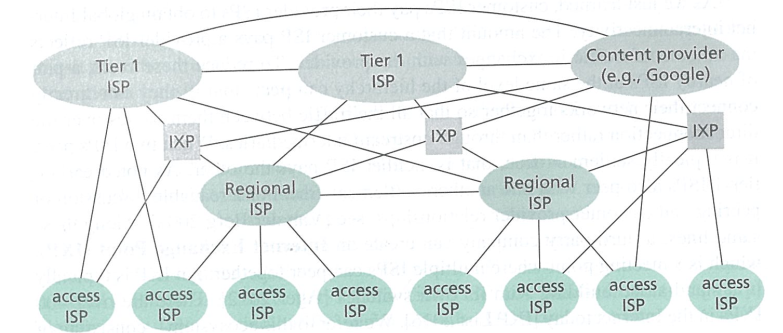
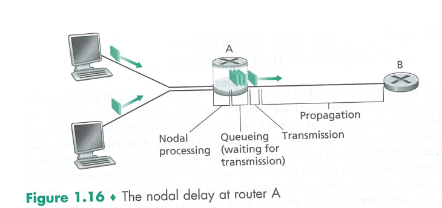
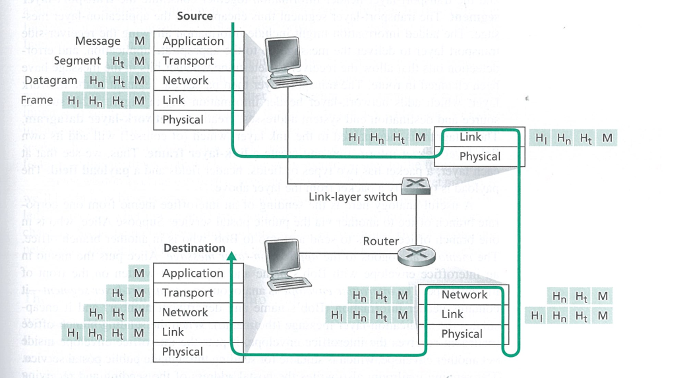
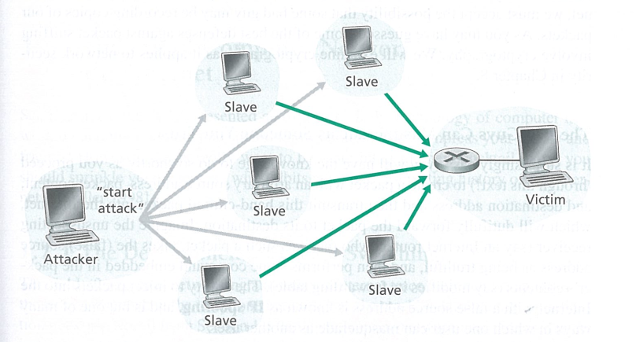

# Chapter 1

## 1.1 Introduction
End system access the Internet through Internet Service Providers(ISPs), including residential ISPs such as local cable or telephone companies; corporate ISPs; university ISPs...

* Internet standards are developed by the Internet Engineering Task Force(IETF). The IETF standards documents are called requests for comments(RFCs).
* End system attached to the Internet provide a socket interface that specifies how a program running on one end system asks the Internet infrastructure to deliver data to a specific destination program running on another end system.

## 1.2 The network edge
Today, the two most prevalent types of broadband residential access are digital subscriber line(DSL) and cable.
* DSL: A residence typically obtains DSL Internet access from the same local telephone company that provides its wired local phone access. Thus, when DSL is used, a customer's telco is also its ISP.
* Cable Internet access makes use of the cable television company's existing cable television infrastructure.
* fiber to the home(FTTH) provide an optical fiber path from the CO(center office) to directly to the home

Access in the Enterprise and the Home: Ethernet and WIFI

* Ethernet: Ethernet users use twisted-pair copper wire to connect to an Ethernet switch, or a network of such interconnected switches, is then in turn connected into the larger Internet.(With Ethernet access, users typically have 100Mbps or 1Gbps access to the Ethernet switch whereas servers may have 1Gbps or even 10Gbps access.)
* WIFI, wireless.

### Physical Media
For each transmitter-receiver pair, the bit is sent by propagating electromagnetic waves or optical pulses across a physical medium.
Physical media fall into two categories: guided media and unguided media.
* With guided media: the waves are guided along a solid medium, such as fiber-optic cable, twisted-pair copper wire, or a coaxial cable.
* With unguided media, the waves propagate in the atmosphere and in outer space, such as in a wireless LAN or a digital satellite channel.

Wire type
* Twisted-pair Copper Wire. This is the least expensive and most commonly used guided transmission medium. Unshielded twisted pair(UTP) is commonly used for computer network within a building. 
* Coaxial Cable: Like twisted pair, coaxial cable consists of two copper conductors, but the two conductors are concentric rather than parallel. With this construction and special insulation and shielding, coaxial cable can achieve high data transmission rates. Coaxial cable is quite common in cable television systems. Coaxial cable can be used as a guided shared medium.
* Fiber Optics: An optical fiber is a thin, flexible medium that conducts pulses of light, with each pulse representing a bit. A single optical fiber can support tremendous bit rates, up to tens or even hundreds  of gigabits per second. They are immune to electromagnetic interferene, have very low signal attenuation up to 100 kilometers, and are very hard to tap. These characteristics have made fiber optics the preferred long-haul guided transmission media, particularly for overseas links.
* Terrestrial Radio Channels
* Satellite Radio Channels

## 1.3 The Network Core
### 1.3.1 Packet Switching
In a network application, end systems exchanges messages with each other. To send a message from a source end system to a destination end system, the source breaks long messages into smaller chunks of data known as packets. Between source and destination, each packet travels through communication links and packet switches(two predominant types: routers and link-layer switches).

* Most packet switches use store-and-forward transmission at the inputs to the links. Store-and-forward transmission means that the packet switch must receive the entire packet before it can begin to transmit the first bit of the packet onto the outbound link.
Consider the general case of sending one packet of size L from source to destination over a path consisting of N links each of rate R. The end-to-end delay is:
$$
d_{end-to-end} = N\frac{L}{R}
$$

#### Queuing Delays and Packet Loss
Each packet switch has multiple links attached to it. For each attached link, the packet switch has an output buffer(also called output queue)  which stores packets that the router is about to send to that link. 

* If an arriving packet needs to be transmitted onto a link but finds the link busy with the transmission of another packet, the arriving packet must wait in the output buffer. This is queuing delays.

* Since the amount of buffer space is finite, an arriving packet may find that the buffer is completely full with other packets waiting for transmission. In this case, packet loss will occur--either the arriving packet or one of the already-queued packets will be dropped.

#### Forwarding Tables and Routing Protocols
Each router has a forwading table that maps destination addresses(or portions of destination addresses) to that router's outbound links.
The Internet has a number of special routing protocols that are used to automatically set the forwarding tables.

### 1.3.2 Circuit Switching
There are two fundamental approaches to moving data through a network of links and switches: circuit switching and packet switching.
In circuit switching, the network establishes a dedicated end-to-end connection between the two hosts.
Once the circuit established, it reserves a constant transmission rate in the network's links. The sender can transfer data to the receiver  at the guaranteed constant rate.

#### Multiplexing in Circuit-Switched Networks
A circuit in a link is implemented with either frequency-division multiplexing(FDM) or time-division multiplexing(TDM).

Circuit switching is wasteful because the dedicated circuits are idle during silent periods.

### 1.3.3 A Network of Network

## 1.4 Delay, Loss, and Throughput in Packet-Switched Network
total delay = nodal processing delay + queuing delay + transmission delay + propagation delay

queuing delay depends on traffic intensity: La/R, say a file is L bits, one second comes a files, and the transmit rate of the router is R. If La/R < 1, no delay, if La/R > 1, the delay can be huge.(especially the average La/R > 1)

Suppose there are N-1 routers between the source host and the destination host.
$$
d_{end-end} = N(d_{proc} + d_{transmit} + d_{propagation})
$$

### 1.4.4 Throughput in Computer Networks
instantaneous throughput at any instant of time is the rate at which host is receiving the file.
average throughput
Bottleneck link

## 1.5 Protocol Layers and Their Service Models
### 1.5.1
* Service model of a layer is the services that a layer offers to the layer above.
* Each layer provides its service by
* 1. Performing certain actions within that layer
* 2. using the services of the layer directly below it.

Drawback of layering:
1. one layer may duplicate lower-layer functionality. For example, many protocol stacks provide error recovery on both a per-link basis and an end-to-end basis.
2. Functionality at one layer may need information that is present only in another layer, this violates the goal of separation of layers.

The protocols of the various layers are called the protocol stack. The Internet protocol stack consists of five layers: the physical, link, network, transport and application layers.
1. application layer
* The application layer is where network applications and their application-layer protocols reside.
*  The Internet's application layer includes many protocols, such as the HTTP, SMTP, and FTP.
* The packet of information at the application layer is message.

2. Transport Layer 
 * The Internet's transport layer transports application-layer messages between application endpoints. In the Internet there are two transport protocols, TCP and UDP
 * The transport-layer packet is called segment in this book

3. Network Layer
* The Internet's network layer is responsible for moving network-layer packets known as datagrams from one host to another. 
* The internet's network layer includes the IP protocol and many routing protocols. But the most important is IP protocol, so it is often simply referred to as the IP layer.
* The Internet's network layer routes a datagram through a series of routers between the source and destination.
* The network-layer packet is called datagram in this book

4. Link Layer
* link layer provide transform between node and node. The network layer passes the datagram down to the link layer, which delivers the datagram to the next node along the route. At this next node, the link layer passes the datagram up to the network layer.
* The services provided by the link layer depend on the specific link-layer protocol.
* Examples of link-layer protocols include Ethernet, WIFI, and the cable access network's DOCSIS protocl.
* The link-layer packet is called frame in this book

5. Physical Layer
* The job of the physical layer is to move the individual bits within the frame from one node to the next. 
* The protocols in this layer are again depend on the actual transmission medium of the link(for example, twisted-pair copper wire, single-mode fiber optics)

### 1.5.2 Encapsulation

## 1.6 Networks Under Attack
Much of the malware out there today is self-replicating
Viruses are malware that require some form of user interaction to infect the user's device.
Worms are malware that can enter a device without any explicit user interaction.

denial-of-service(DoS) attacks.
a DoS attack renders a network, host, or other piece of infrastructure unusable by legitimate users.
Method: Vulnerability attack, Bandwidth flooding
distributed DoS(DDoS) attack

packet sniffer

IP spoofing

