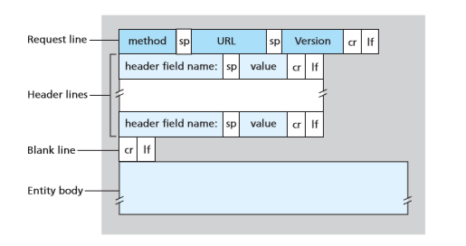
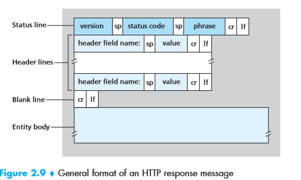
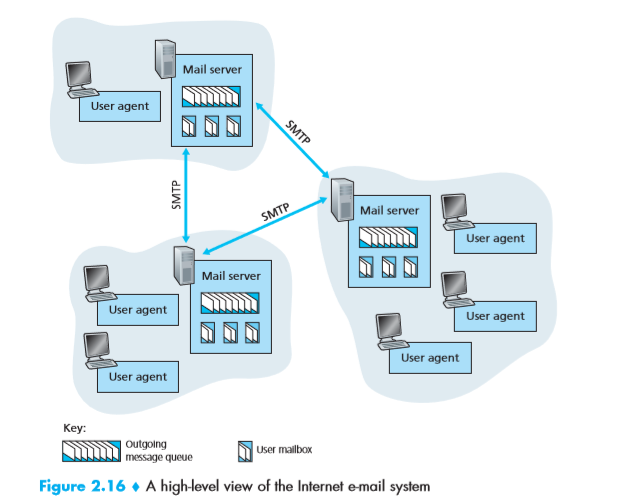
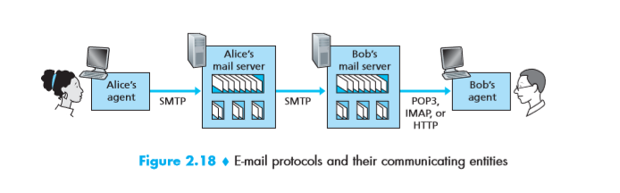

Application architecture

## 2.1
#### client-server architecture: 
* there is an always-on host, called server, which services requests from many other hosts.
* Since one server may not enough, there are some data center.

#### Peer to peer architecture:
* the application exploits direct communication between pairs of intermittently connected hosts, called peers.
* One of the most compelling features of P2P is their self-scalability.
* However, P2P applications face challenges of security, performance, and reliability due to their highly decentralized structure.

#### Interface Between the Process and the computer network

A process sends messages into. and receives messages from, the network  through a software interface called socket. process is like a house, and socket is like the door, we can send through the door and believe it.

The developer has little control of transport-layer side:

(1) the choice of transport protocol

(2) the ability to fix a few transport-layer parameters such as maximum buffer and maximum segment sizes.

#### Possible Services transport-layer protocol provide

1. Reliable data transfer(data loss might be acceptable for loss-tolerant applications such as conversational audio/video)
2. Throughput(bandwidth-sensitive applications such as internet telephony application, it may adapt the coding techniques to match the available throughput)(elastic applications such as electronic mail is not sensitive to this)
3. Time(important for real-time application)
4. Security(encrypt and decrypt)

#### TCP and UDP
TCP:
Connection-oriented service: connect before transfer
Reliable data transfer services
congestion-control mechanism

Securing TCP:
TCP not include encryption but we can use Secure Socket Layer(SSL) to get TCP-enhanced-with-SSL.

UDP:
no-frills, lightweight transport protocol
connectionless, unreliable data transfer, data may arrive out of order, does not include congestion-control mechanism.

No guarantees for timing nor throughput, but can provide a well services in most cases.

Tips:
most telephone use udp since it is faster and can accept some loss, but because many firewalls are configured to block(most types of) UDP traffic, Internet telephony applications often are designed to use TCP as a backup if UDP communication fails.

#### Application Layer Protocols
An application layer protocol defines:
* The types of messages exchanged
* The syntax of the various message types.
* The semantics of the fields
* Rules for determining when and how a process sends messages and responds to messages.

(HTTP,SMTP)

## 2.2
### HTTP
HTTP(HyperText Transfer Protocol) use TCP
Since an HTTP server maintains no information about the clients, HTTP is said to be a stateless protocol.

#### web page
web page consists of objects.
An object is simply a file such as HTML file, JPEG image etc.
most web pages consist of a base HTML file and several referenced objects(URL)
#### Non-Persistent and Persistent Connect
round-trip time(RTT) The time it takes for a small packet to travel from client to server and then back to the client.
In non-persistent connect, server will close the connect every time transform finished, it we want to get a web page with a html and 10 jpg, we need to set up connect 11 times
browser support parallel request, which will be much faster

In persistent connect, connection will keep open until isn't used for certain time(timeout interval). 
These request for objects can be made back-to-back, without waiting for replies to pending requests(pipeline)

#### Request

(cr: carriage return回车, lf line feed换行)
GET, POST(GET with input, such as search, can replaced by GET), HEAD(GET, response HTTP without requested object, often for debug)
PUT(upload) DELETE

#### cookies
set-cookie: 1678
cookie:1678 everytime
#### web caching
#### conditional GET
get with if-modified-since:
if not modified, return the cache, this will save bandwidth and time

## 2.3 Electronic Mail in the Internet

The three major components: user agent, mail servers, Simple Mail Transfer Protocol(SMTP)

SMTP连接为直接连接，没有中介服务器
### Different between HTTP and SMTP
1. 
SMTP is mainly a push protocol
HTTP is mainly a pull protocol
2. 
SMTP requires each message to be in 7-bit ASCII format
HTTP data dose not impose this restriction
3. 
HTTP encapsulates each object in its own HTTP response message.
SMTP places all of the message's objects into one message.

### Mail Access Protocol

因为用户的电脑不可能一直开机联网，所以邮件传输需要中介服务器，根据图中的信息，Alice发送的邮件可以通过SMTP传输到Bob的mail server那里，但因为SMTP是push的协议，所以Bob无法用SMTP协议接收邮件，为了实现这个需求，我们有三个协议可以使用POP3（相对简单，功能较弱），IMAP，和HTTP（因为很多网页版的邮件，所以被广泛使用）

