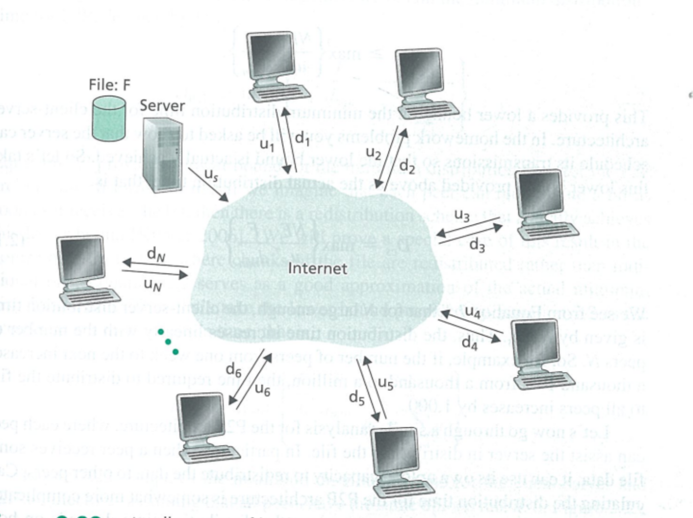

# Application architecture

## 2.1
#### client-server architecture: 
* there is an always-on host, called server, which services requests from many other hosts.
* Since one server may not enough, there are some data center.

#### Peer to peer architecture:
* the application exploits direct communication between pairs of intermittently connected hosts, called peers.
* One of the most compelling features of P2P is their self-scalability.
* However, P2P applications face challenges of security, performance, and reliability due to their highly decentralized structure.

#### Interface Between the Process and the computer network

A process sends messages into. and receives messages from, the network  through a software interface called socket. process is like a house, and socket is like the door, we can send through the door and believe it.

The developer has little control of transport-layer side:

(1) the choice of transport protocol

(2) the ability to fix a few transport-layer parameters such as maximum buffer and maximum segment sizes.

#### Possible Services transport-layer protocol provide

1. Reliable data transfer(data loss might be acceptable for loss-tolerant applications such as conversational audio/video)
2. Throughput(bandwidth-sensitive applications such as internet telephony application, it may adapt the coding techniques to match the available throughput)(elastic applications such as electronic mail is not sensitive to this)
3. Time(important for real-time application)
4. Security(encrypt and decrypt)

#### TCP and UDP
TCP:
Connection-oriented service: connect before transfer
Reliable data transfer services
congestion-control mechanism

Securing TCP:
TCP not include encryption but we can use Secure Socket Layer(SSL) to get TCP-enhanced-with-SSL.

UDP:
no-frills, lightweight transport protocol
connectionless, unreliable data transfer, data may arrive out of order, does not include congestion-control mechanism.

No guarantees for timing nor throughput, but can provide a well services in most cases.

Tips:
most telephone use udp since it is faster and can accept some loss, but because many firewalls are configured to block(most types of) UDP traffic, Internet telephony applications often are designed to use TCP as a backup if UDP communication fails.

#### Application Layer Protocols
An application layer protocol defines:
* The types of messages exchanged
* The syntax of the various message types.
* The semantics of the fields
* Rules for determining when and how a process sends messages and responds to messages.

(HTTP,SMTP)

## 2.2
### HTTP
HTTP(HyperText Transfer Protocol) use TCP
Since an HTTP server maintains no information about the clients, HTTP is said to be a stateless protocol.

#### web page
web page consists of objects.
An object is simply a file such as HTML file, JPEG image etc.
most web pages consist of a base HTML file and several referenced objects(URL)
#### Non-Persistent and Persistent Connect
round-trip time(RTT) The time it takes for a small packet to travel from client to server and then back to the client.
In non-persistent connect, server will close the connect every time transform finished, it we want to get a web page with a html and 10 jpg, we need to set up connect 11 times
browser support parallel request, which will be much faster

In persistent connect, connection will keep open until isn't used for certain time(timeout interval). 
These request for objects can be made back-to-back, without waiting for replies to pending requests(pipeline)

#### Request

(cr: carriage return回车, lf line feed换行)
GET, POST(GET with input, such as search, can replaced by GET), HEAD(GET, response HTTP without requested object, often for debug)
PUT(upload) DELETE

#### cookies
set-cookie: 1678
cookie:1678 everytime
#### web caching
#### conditional GET
get with if-modified-since:
if not modified, return the cache, this will save bandwidth and time

## 2.3 Electronic Mail in the Internet

The three major components: user agent, mail servers, Simple Mail Transfer Protocol(SMTP)

SMTP连接为直接连接，没有中介服务器
### Different between HTTP and SMTP
1. SMTP is mainly a push protocol
HTTP is mainly a pull protocol
2. SMTP requires each message to be in 7-bit ASCII format
HTTP data dose not impose this restriction
3. HTTP encapsulates each object in its own HTTP response message.
SMTP places all of the message's objects into one message.

### Mail Access Protocol

因为用户的电脑不可能一直开机联网，所以邮件传输需要中介服务器，根据图中的信息，Alice发送的邮件可以通过SMTP传输到Bob的mail server那里，但因为SMTP是push的协议，所以Bob无法用SMTP协议接收邮件，为了实现这个需求，我们有三个协议可以使用POP3（相对简单，功能较弱），IMAP，和HTTP（因为很多网页版的邮件，所以被广泛使用）

## 2.4DNS
### hierarchy of DNS server
root 
TLD(Top-level Domain): country
authoritative: organization

local DNS server

这里面包含了迭代查询和递归查询，因为TLD很可能不直接知道authoritative DNS server的IP，只知道谁知道那个IP，所以在第三层，实际做了两次查询，是一个递归操作

DNS type

(name, value, type, ttl)

A: address of a host(relay.bar.foo.com, 127.0.0.1)

NS: name is domain and value is host (foo.com, dns.foo.com)

CNAME: canonical name(foo.com, relay.bar.foo.com)

MX: for mail(foo.com, mail.bar.foo.com)

In authoritative server, it contains A

In TLD, it contains A which is cached, it also contains NS, A pair for the DNS, such as (foo.com, dns.foo.com, NS), (dns.foo.com, 127.0.0.1, A)

Identification用来作为识别号，让client识别response是哪个request的，response时要附带相同的identification。

FLags：有很多。1bit for query or quest, 1 bit for authoritative or not, 1 bit for 递归与否

Authority包括其他服务器的记录

additional记录很多其他数据，比如canonical name之类的？

## 2.5 P2P
P2P是scalable的，相比server-client模型，面对大规模网络更加经济省钱

这是一个文件部署的模型，我们在这里需要假设网络的承载量为无限，这样一来我们就可以专注在accessing rate上面了

这里是server-client的最小部署时间，完成部署有两个瓶颈，一个是服务器的上传时间，是NF/us，另一个是下载速度最慢的用户的下载时间，如果服务器上传速度比最小的那个的N倍大，那么就每个用户都固定接收最小的服务器的那个量，时间为F/dmin,如果服务器比最小的那个的N倍小，服务器就按us/N给每个用户传，时间为NF/us

P2P的有些复杂，但为了达到最高效率，我们要让每台服务器都不休息，如果服务器的上传效率。核心思想是让服务器传一份，用户传N-1份，如果用户之和小于N-1us，那么服务器在要把包分成N+1份，全力分配任务给用户后，在用户分发包的剩余时间里，给每个用户传递第N+1个包，然后一起结束，如果大于，就分成N个包，服务器给用户分发的任务用户全部能消化，这样一来，分发结束，也就是部署结束的时候

BitTorrent是一个曾经使用很广的内容分发协议，有如下几个特征：

rarest first:从周围邻居中，优先请求请求自己没有，且在邻居中最稀有的包

unchoked：优先给给自己传输文件速率最高的四个peer传输文件，每10s重新算一次

optimistically unchoked：每隔30s时间，随机选一个peer发一个包，看看能不能形成新的交易协定？

## 2.6 stream video
通过单纯的HTTP协议，我们无论网络好坏，都只能请求相同版本的视频资源，这显然是不够合理的，所以有了DASH这种协议
DASH(Dynamic Adaptive Streaming over HTTP)允许传输多种规格的视频资源，HTTP服务器上有一个manifest，client可以请求到这个manifest，然后根据自己的网络情况和缓存情况，动态地决定下一个包该发向哪一个URL，(每个版本的视频都有自己独立的一个URL，manifest记录了这些信息)

CDN：
因为内容分发网站，比如YouTube，Netflix这些，需要稳定而大量的数据发送，如果只建立一个data center，会导致对远方的数据传递变得非常差，所以需要建立自己的数据中心，建立content distribution network
CDN有两种，一种是私有的，比如说Google给YouTube提供的，另一种是第三方经营的，这些都可以帮助内容分发。
CDN可以将用户的需求定向到最近的数据库，一般来说会采用cluster selection strategy来选择重定向到哪个数据库，最简单的方法是直接暴力计算鸟飞距离，但这样显然忽略了很多细节，所以更进一步，可以定时测试每个数据库的通信情况，但很多LDNS并不回复这样的请求。

## 2.7 Socket Programming
UDP的server直接接收数据
TCP的server先accept分发socket再接收数据，接收完成可以关闭socket
