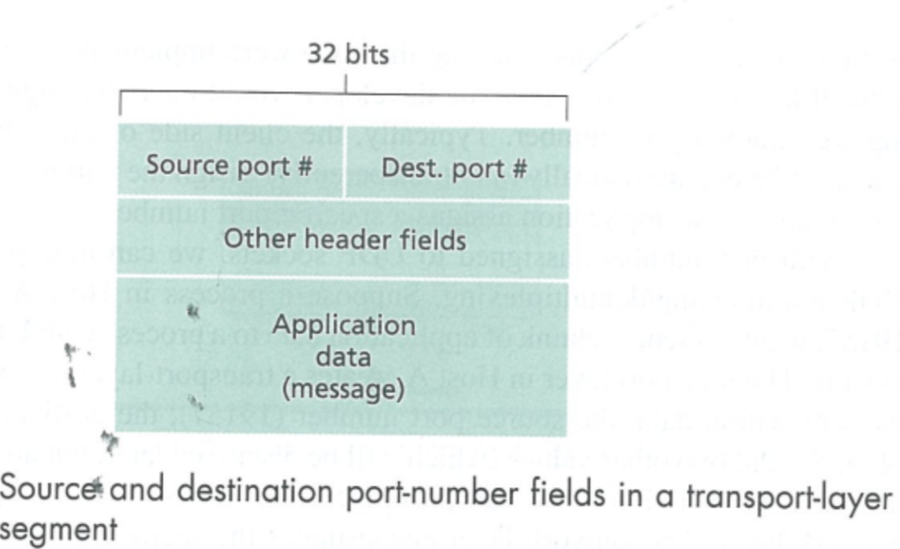
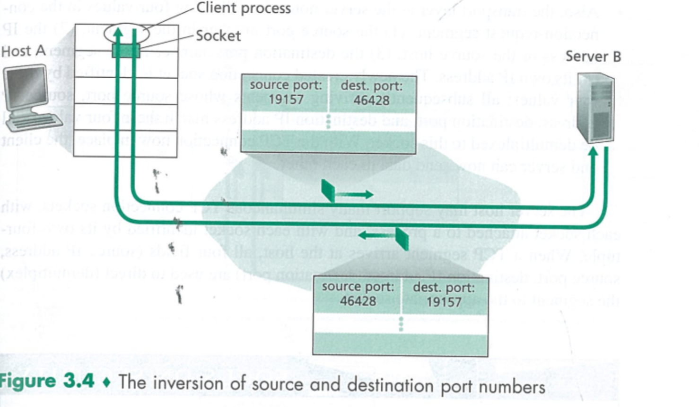
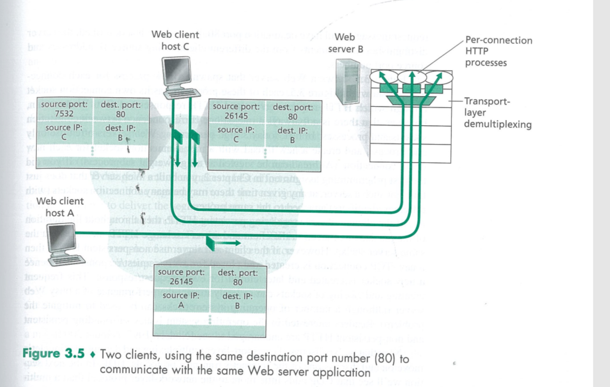
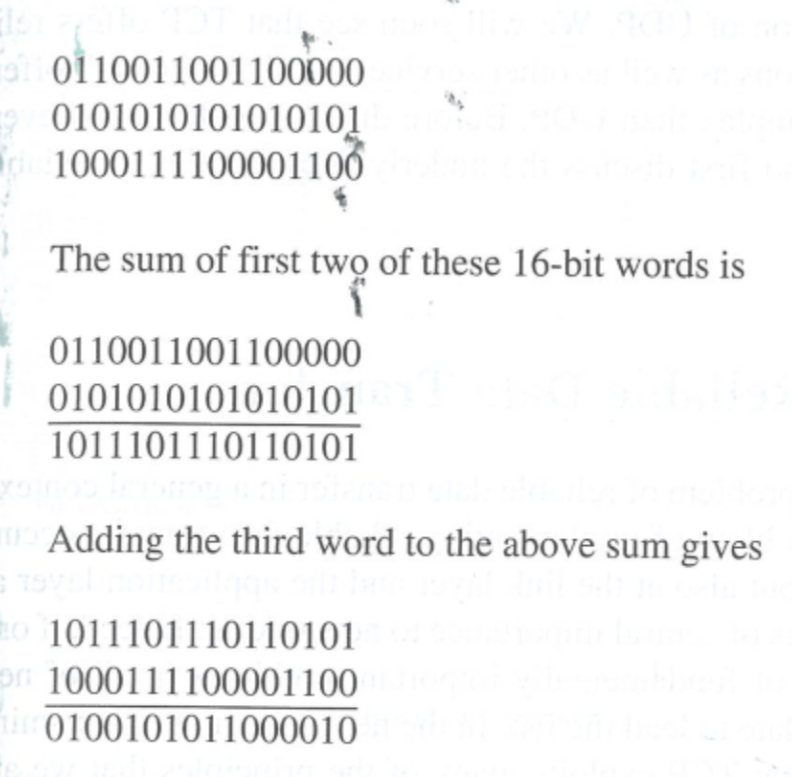

# Transport Layer
## 3.1
A transport-layer protocol provides for logical communication between application processes running on different hosts.

transport layer和network layer的区别是一个提供了process间的logical communication，一个提供了host间的logical communication，用快递的例子打个比方，network提供的是城际之间的货运服务，transport则提供的是送货上门的包裹派送服务，而收包裹的我们，则是process，城市，就是host，transport layer会把application layer 的信息拆分成很多small chunks，然后给每个chunk加一个transport layer的header，把他们变成transport layer的segment，然后再交给network layer发送，network layer会再次encapsulate 这些segment成为datagram。

transport layer只存在于终端机上面

There are two  distinct transport-layer protocols available to the application layer.

* UDP(User Datagram Protocol) provides an unreliable, connectionless service. The packet is called datagram(for network-layer packet, it is also called  datagram)
* TCP(Transmission Control Protocol), provides a reliable, connection-oriented service to the invoking application. The packet is called segment.
* To simplify terminology, in this book, we refer to the transport-layer packet as a segment.

Internet's network-layer protocol is called  IP(Internet Protocol)
IP provides logical communication between hosts. The IP service model is a best-effort delivery service. This means that IP makes its "best effort" to deliver segments between communicating hosts, but it makes no guarantees. In particular, it does not guarantee segment delivery, it does not guarantee orderly delivery of segments, and it does not guarantee the integrity of the data in the segments.
For this reason, IP is said to be an unreliable service.

Service provided by UDP and TCP
* The most fundamental responsibility of UDP and TCP is to extend IP's delivery service between two end systems to a delivery service between two processes running on the end systems. Extending host-to-hos delivery to process-to-process delivery is called transport-layer multiplexing and demultiplexing.
* UDP and TCP also provide integrity checking by including error-detection fields in their segments' headers. UDP is an unreliable service, but TCP provides reliable data transfer.
* TCP provides congestion control while UDP don't.

## 3.2 Multiplexing and Demultiplexing

multiplexing是transport layer将各个端口发出的数据收集起来扔给网络层传输的过程
demultiplexing是传输层将收到的信息，根据port给各个接口分发的过程

传输层的头，包括source port number 和 destination port number
port number是一个16bit的数字，从0到65535，其中0-1023被叫做well-known port numbers,这些是被留给知名应用的，比如说HTTP(port 80), FTP(port 21)

Figure 3.4是udp的socket连接，这里我们可以看出，识别的符号是个两元组，也就是说，再demultiplexing环节，只要是相同 dest port number的消息，即使是不同服务器发出的，也会发到相同的端口上。

port 12000作为welcome 端口，会给每一个请求连接分配一个独一无二的端口，TCP是由一个四元组构成，也就是说，这个连接只对特定host，特定port开放

## 3.3 Connectionless Transport UDP

UDP的segment格式

checksum的生成方式，将所有这些数据加起来（这里有三个16bits的word），如果最高位进位，就加到最低位上。然后将所有加和结果对1取反，取反结果为checksum，然后接收方将所有数据以及checksum加一起，如果全是1，则为正确，如果有0，说明有问题。