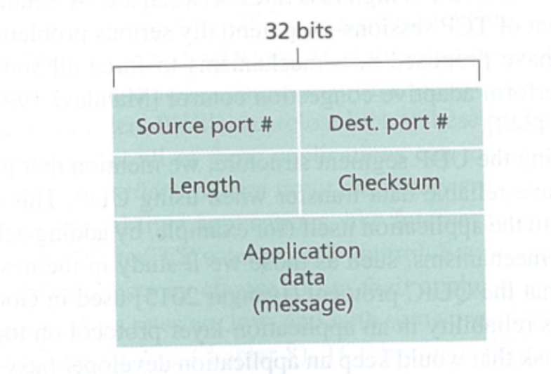
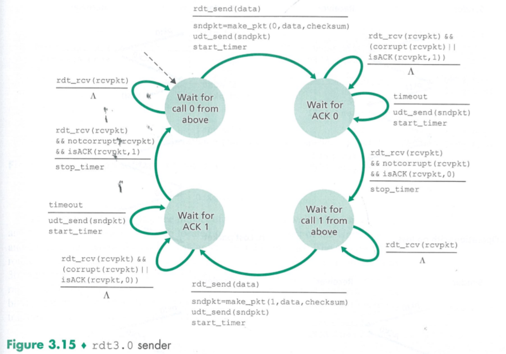
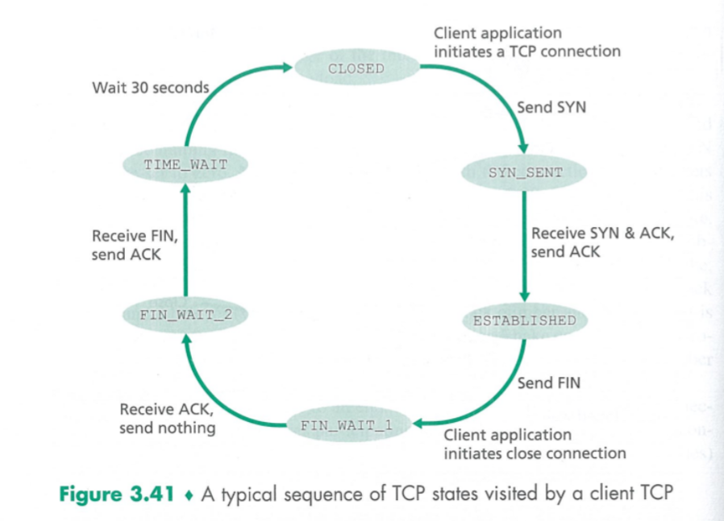

# Transport Layer

## 3.1
A transport-layer protocol provides for logical communication between application processes running on different hosts.

transport layer和network layer的区别是一个提供了process间的logical communication，一个提供了host间的logical communication，用快递的例子打个比方，network提供的是城际之间的货运服务，transport则提供的是送货上门的包裹派送服务，而收包裹的我们，则是process，城市，就是host，transport layer会把application layer 的信息拆分成很多small chunks，然后给每个chunk加一个transport layer的header，把他们变成transport layer的segment，然后再交给network layer发送，network layer会再次encapsulate 这些segment成为datagram。

transport layer只存在于终端机上面

There are two  distinct transport-layer protocols available to the application layer.

* UDP(User Datagram Protocol) provides an unreliable, connectionless service. The packet is called datagram(for network-layer packet, it is also called  datagram)
* TCP(Transmission Control Protocol), provides a reliable, connection-oriented service to the invoking application. The packet is called segment.
* To simplify terminology, in this book, we refer to the transport-layer packet as a segment.

Internet's network-layer protocol is called  IP(Internet Protocol)
IP provides logical communication between hosts. The IP service model is a best-effort delivery service. This means that IP makes its "best effort" to deliver segments between communicating hosts, but it makes no guarantees. In particular, it does not guarantee segment delivery, it does not guarantee orderly delivery of segments, and it does not guarantee the integrity of the data in the segments.
For this reason, IP is said to be an unreliable service.

Service provided by UDP and TCP
* The most fundamental responsibility of UDP and TCP is to extend IP's delivery service between two end systems to a delivery service between two processes running on the end systems. Extending host-to-hos delivery to process-to-process delivery is called transport-layer multiplexing and demultiplexing.
* UDP and TCP also provide integrity checking by including error-detection fields in their segments' headers. UDP is an unreliable service, but TCP provides reliable data transfer.
* TCP provides congestion control while UDP don't.

## 3.2 Multiplexing and Demultiplexing

multiplexing是transport layer将各个端口发出的数据收集起来扔给网络层传输的过程
demultiplexing是传输层将收到的信息，根据port给各个接口分发的过程

传输层的头，包括source port number 和 destination port number
port number是一个16bit的数字，从0到65535，其中0-1023被叫做well-known port numbers,这些是被留给知名应用的，比如说HTTP(port 80), FTP(port 21)

Figure 3.4是udp的socket连接，这里我们可以看出，识别的符号是个两元组，也就是说，再demultiplexing环节，只要是相同 dest port number的消息，即使是不同服务器发出的，也会发到相同的端口上。

port 12000作为welcome 端口，会给每一个请求连接分配一个独一无二的端口，TCP是由一个四元组构成，也就是说，这个连接只对特定host，特定port开放

## 3.3 Connectionless Transport UDP

UDP本质上类似于一个纯粹的传输层协议，没有在传输层协议之上做特别多的事情，所以像是RDT，交通管理这些，UDP是不提供的，但是，UDP因为简单，快速，不限量，还是受到很多人喜欢的，Google的浏览器就是使用的UDP，但是在应用层层面实现了RDT，也就是说，传输层实现不了的很多功能，也同样可以在应用层实现，只不过维护比较麻烦

UDP的segment格式

checksum的生成方式，将所有这些数据加起来（这里有三个16bits的word），如果最高位进位，就加到最低位上。然后将所有加和结果对1取反，取反结果为checksum，然后接收方将所有数据以及checksum加一起，如果全是1，则为正确，如果有0，说明有问题。

## 3.4 Principles of Reliable Data Transfer
reliable data transfer protocol负责实现可靠的数据传输

这是一个RDT的示意图，RDT负责在不可靠的网络层传输通道的基础上，实现一个可靠的传输通道并提供给应用层

我们在这里讨论的是unidirectional data transfer，也就是说，数据单向传输，双向数据传输（full-duple）思想类似，但实现起来更加麻烦

### Building a Reliable Data Transfer Protocol

RDT的基于finite-state machine（FSM）构建的

rdt1.1建立在网络层可靠不丢包的基础上，没有做额外处理，基本不现实

rdt2.0 引入了NAK（negative acknowledgements）和ACK（positive acknowledgements）的概念，如果判断收到的回复是NAK，那么sending side将重新发送这个包，也就是ARQ(Automatic Repeat request) protocols

但这存在一个问题，就是如果ACK丢包了，该怎么处理，一般的处理方法是重新发送（duplicate packets），但是，接收方该怎么判断这个包是新的，还是上一个呢，所以我们引入了一个新概念，sequence number

在这里，我们的sequence number只有0和1，我们现在一次只能发一个包，所以一个bit足够了

rdt2.2删去了NAK的概念，只保留了ACK，如果当前接受包被破坏，那么，只需要返回上一个接受包的ACK，这样一来，发送端就知道该继续发送当前这个包，知道收到当钱包的ACK为止

rdt3.0的sender实现了另一个功能，就是countdown timer，负责计时，如果超时未收到ACK，则重新发包。

rdt3.0有时也被叫做alternating-bit protocol
### 3.4.2 Pipelined Reliabe Data Transfer Protocols
rdt每发一个包，都需要等待回复，这样的交互时间是很长的，导致大量的时间损耗在传输上，效率不高，尤其是远距离传输，所以引入了pipeline的概念，一口气发很多包，然后挨个等待回复，而解决丢包的方案，有两个比较基础的：Go-Back-N and selective repeat

### 3.4.3
Go-Back-N(GBN) protocol

GBN有四部分组成，第一部分是已经确定的，第二部分是已经发了但是没收到ACK的，第三部分是可以发的，第四部分是暂时用不上的

GBN本身就是一个sliding window protocol

如果超时的话，会把未确认的部分全部重新发一次，在效率上，是不太令人满意的

GBN需要处理三种events：

Invocation from  above：如果还有空位，就发一个包，没有就算了

Receipt of an ACK：标记ACK的包，并且移动滑窗，因为这里是cumulative acknowledgement，所以如果base是10，而受到了20的ACK，意味着20以前的所有包都ok

Timeout event：重发所有发出但没有受到ACK的包，Timer的时间是按照最旧的一个包来计算了，每次重发，更新最旧的包都会重置timer

在我们的GBN实现里面，receiver会直接扔掉out-of-order 的包，每次重发包都会全发一遍。（当然，如果真的乱序了，也会导致更多的不必要的重传

### Selective Repeat(SR)

GBN一言不合全部重来的实现虽然相对简单，但效率显然不高，所以就有了选择重传的方式

选择重传接收乱序的包裹

发送方的Timeout在这里要对每个包都做，而不是最旧的那个，ACK要考虑移动滑窗的问题

收到数据之后，如果之前没有，还在滑窗之内，要缓存起来，如果到了可以移动滑窗的程度，那么把这段数据向上层传递，然后移动滑窗，

第二个操作是非常玄妙的，我们必须相信他是有用的，如果我们收到包裹，发了ack，然后移动了滑窗，但是ack丢了，那么sender将不知道这件事情然后疯狂发包，就很傻，所以，为了玄学debug，我们要相信这步操作是有用的

## 3.5 Connection-Oriented Transport: TCP

TCP是一个connection-oriented协议

full-duplex service：可以同时双向传递数据

point-to-point：单一的发送方和接收方

需要三次握手（three-way handshake）

TCP在三次握手的时候会预留出buffer，发送和接收的信息全部暂时存到buffer里面，至于什么时候发送，什么时候分发，都由TCP决定，TCP有限流的机制，不想UDP一样一股脑全倒进去

发送包时，TCP会把数据分拆成很多chunks，然后把这些chunks包装成segment，但是每个segment能够装的应用层数据是有上限的，上限叫做maximum segment size（MSS），这个上限受到maximum transmission unit（MTU）的限制，MTU时连接层frame的最大大小，MTU一般为1500bytes，除去header，MSS一般为1460 bytes。

Options的部分一般不用

这里最核心的时sequence number和acknowledgement number

TCP会将数据分成segment，每个segment的sequence number就是这个sequence最开始的那个数据的序号，比如图中第一个的sequence number时0，第二个是1000

cumulative acknowledgement：

如果接收方收到了0-535以及900-1000，那么接收方会返回一个acknowledgement number为536的segment，告诉对方自己在等536开始的数据

这是一个echo的传输过程，host A发送一个C，然后host B返回ACK和C，host A返回ACK，这里第二个包有两种功能，被称为piggybacked

### 3.5.3 Round-Trip Time Estimation and Timeout

RTT需要被拿来估计Timeout的时间，所以非常重要

Sample RTT是实际测量的RTT，一般来说同一时刻只会测一个un ACKED的包的RTT，而不是每一个

EstimatedRTT = （1-α） * EstimatedRTT + α * SampleRTT

一般来说α取0.125，也就是八分之一

这样的平均被叫做exponential weighted moving average（EWMA）

至于为什么，这类似于神经网络中的RNN

DevRTT = (1 - β) * DevRTT + β * |SampleRTT - EstimatedRTT|

β一般取0.25

Timeout interval由EstimatedRTT和DevRTT构成

TimeoutInterval = EstimatedRTT + 4 * DevRTT

### 3.5.4 Reliable Data Transfer

每次重发之后，timeout的时间都会double，所以我们能够看到segment 100并没有重发

因为是accumulate acknowledge，所以即使ACK 100 丢了，因为由ACK 120，所以也无所谓

Fast Retransmit

在timeout之前，实际上已经能够判断出来丢包现象，所以可以实现快速重传

实现快速重传的基石是duplicate ACK，一般来说，如果重复超过三次，就是做丢包，进行快速重传

TCP的重传机制可以说是GBN和SR的混血，叫做selective acknowledgment

### 3.5.5 Flow Control

TCP有flow control，不会把对方的buffer打爆，（buffer爆了之后会疯狂扔包，然后就不断丢包了

所以每次都会发receive window, rwnd

rwnd = RevBuffer - [lastByteRevd - LastByteRead]

lastByteRevd，最后一个收到的byte

lastByteRead， 最后一个被上层读取的byte

rwnd要确保大于零，如果发过去这个包rwnd要比零小，那么就压住不发

### 3.5.6 TCP Connection Management

step1:客户端发送请求，syn设为1，随机一个数字作为initial sequence number

step2:服务端同意请求，syn设为1，ack 为 client_isn + 1,随机一个数字作为initial sequence number，并且会预留buffer（SYNACK)

step3:客户端确认，syn设为0，ack为server_isn + 1,这时有可能会有请求信息放在segment payload里面

四次挥手，用户端发出结束，服务端确认收到，服务端发出结束，用户端确认收到，并且等待一段时间（可能要进行重传操作），然后关闭清空数据

TCP state

